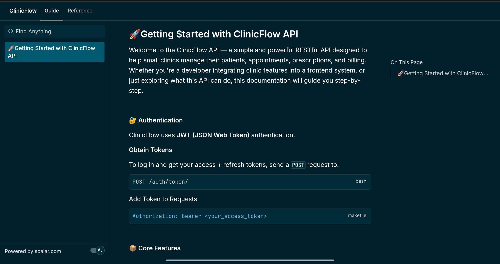
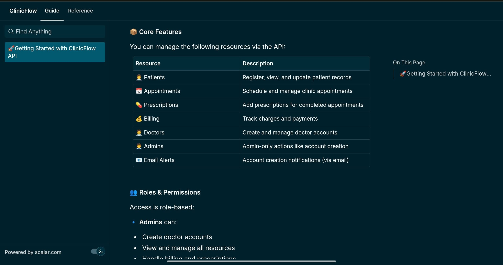
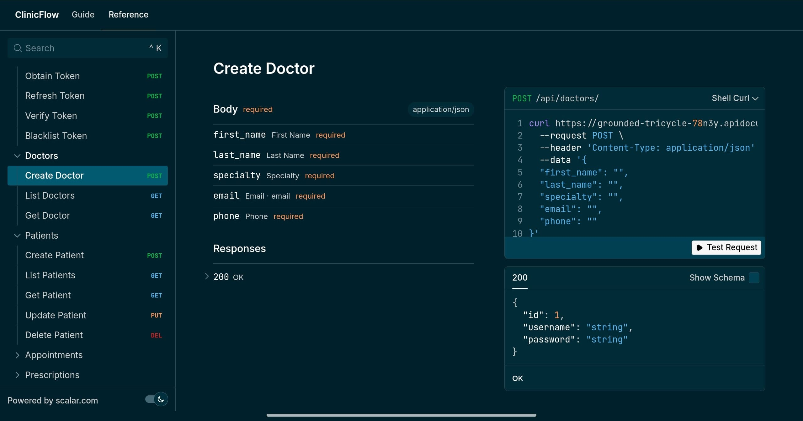
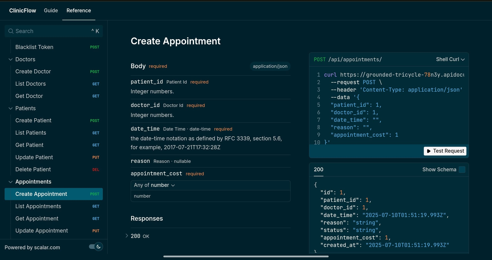

# 🏥 ClinicFlow API

**ClinicFlow** is a role-based RESTful API for managing clinic operations including patients, doctors, appointments, prescriptions, and billing. Built with **Django Ninja**, it offers a lightweight, fast, and secure solution for small-to-medium-sized clinics.

---

## 📌 Features

- 🔐 JWT Authentication (Admin & Doctor roles)
- 👨‍⚕️ Doctor Management (Admin-only)
- 👩‍⚕️ Patient CRUD (Doctors & Admins)
- 📅 Appointment Scheduling (Role-restricted logic)
- 💊 Prescription Logging (Doctor-only, per appointment)
- 💰 Monthly Billing Reports (Aggregated financial insights)
- 📧 Email Notifications (for account creation)

---

## 🚀 Live Documentation (Please Click on the Link)

Explore all endpoints via Scalar Docs:

🔗 [ClinicFlow API Documentation](https://grounded-tricycle-78n3y.apidocumentation.com/)


## 📘 Documentation Preview

### 🧭 Guide Page



### 📂 Reference Page



---

## ⚙️ Tech Stack

- Python 3.11+
- Django
- Django Ninja
- SQLite (for development)
- Django Ninja JWT
- Postman (for testing)
- Scalar (for docs)

---

## 🔐 Authentication

Use `/api/token/pair/` to obtain access & refresh tokens.

Add this to your headers:

```http
Authorization: Bearer <access_token>
```

---

## 📂 Project Structure (simplified)

```
clinicflow/
├── api/
│   ├── endpoints/
│   │   ├── appointments.py
│   │   ├── patients.py
│   │   ├── doctors.py
│   │   ├── prescriptions.py
│   │   ├── billing.py
│   │   └── management.py
│   ├── models.py
│   ├── schema.py
│   └── views.py
├── clinicflow/ (settings)
└── requirements.txt
```

---

## ✅ Getting Started (Local Setup)

```bash
git clone https://github.com/Damilola-Nuga/clinicflow.git
cd clinicflow
python -m venv venv
source venv/bin/activate  # or venv\Scripts\activate on Windows
pip install -r requirements.txt
python manage.py migrate
python manage.py runserver
```


## 📬 Contact

Built with ❤️ by [Nuga]  
If you find this useful, feel free to ⭐ the repo and share.